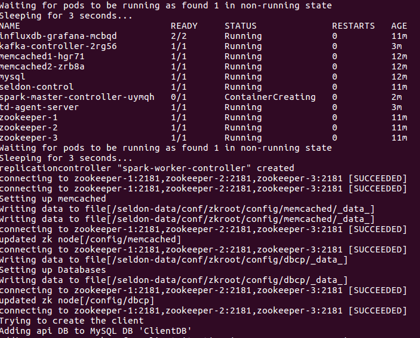

### Deploy Seldon locally on Minikube

Successfully tested on Ubuntu 16.04 with >8GB RAM

#### Prerequisite 1: Install Minikube:
*Requires Virtualbox or KVM*
```
curl -Lo minikube https://storage.googleapis.com/minikube/releases/v0.10.0/minikube-linux-amd64 && chmod +x minikube && sudo mv minikube /usr/local/bin/
# Test minikube start --memory=6000
```

#### Prerequisite 2: Download kubectl (kubernetes):
Recommended version: v1.3.8
```
curl -O https://storage.googleapis.com/kubernetes-release/release/v1.3.8/bin/linux/amd64/kubectl
chmod +x kubectl
sudo mv kubectl /usr/local/bin/kubectl
```

#### Prerequisite 3: Download Seldon:
Recommended version: v1.3.5

```
wget https://github.com/SeldonIO/seldon-server/archive/v1.3.5.zip
sudo apt-get install unzip
unzip v1.3.5.zip
mv seldon-server-1.3.5/ ~/seldon-server
```

#### Prerequisite 4: Configure Python libraries
Recommended: virtualenv

#### Launch Minikube
```
minikube start --memory=8000
```

#### Launch Seldon:
```
# Add Seldon to path
cd ~/seldon-server/kubernetes/bin/; export PATH=$PATH:`pwd`

# Configure config files
cd ../conf
make clean conf

# Launch Seldon
seldon-up.sh
```


Check that Seldon is OK. And [test it!](https://github.com/beeva-labs/research-lab-private/tree/master/recsys/seldon-kubernetes#import-new-dataset)

#### Import dataset
```
kubectl create -f ~/seldon-server/kubernetes/conf/examples/ml100k/ml100k-import.json
```
*To import subset u1 you have to previously edit the file*

#### Train model
```
# Access to seldon-control shell
kubectl exec -it seldon-control /bin/bash

# Build model item-similarity
luigi --module seldon.luigi.spark SeldonItemSimilarity --local-schedule --client ml100k --startDay 1 --ItemSimilaritySparkJob-sample 1.0 --ItemSimilaritySparkJob-dimsumThreshold 1.0 --ItemSimilaritySparkJob-limit 100
```

#### Configure runtime
See [configure_runtime_scorer_isim](https://github.com/SeldonIO/seldon-server/blob/master/docker/examples/ml10m/create_ml10m_recommender.sh)

#### Generate keys
```
SELDONSERVERPOD=`kubectl get pods | grep seldon-server | cut -d' ' -f1`
sudo kubectl port-forward $SELDONSERVERPOD 8080
SELDONKEY=`seldon-cli keys --action list --client-name ml100k --scope all | cut -d' ' -f10 | tail -n1 | sed 's/[^A-Z0-9]//g'`
SELDONSECRET=`seldon-cli keys --action list --client-name ml100k --scope all | cut -d' ' -f4 | tail -n1 | sed 's/[^A-Z0-9]//g'`
# Open localhost:8080
curl http://localhost:8080/token?consumer_key=$SELDONKEY&consumer_secret=$SELDONSECRET
curl http://localhost:8080/users/625/recommendations?oauth_token=XXXX&algorithms=recommenders:MATRIX_FACTOR
```

#### Eval model
Use [RecommendationMetrics scripts](https://github.com/beeva-labs/beeva-poc-seldon/tree/master/recsys/RecommendationMetrics)
```
python SeldonTests.py --host=http://localhost:8080 --compareactionsfile=/home/enriqueotero/datasets/movielens/ml-100k/u1.test --consumerkey=$SELDONKEY --consumersecret=$SELDONSECRET --algorithm=itemsimilarity --insertactionsfile=/home/enriqueotero/datasets/movielens/ml-100k/u1.base
```


#### End:
Close Seldon
```
seldon-down.sh
```
Delete Minikube
```
minikube delete
```

#### Troubleshooting
* Seldon Server (or any other pod) hangs at pending. `kubectl describe pod seldon-server-...` says: *"failed to fit in any node fit failure on node (minikube): Insufficient Memory"*
  * Increase minikube RAM allocation to 8G: `minikube start --memory=8000`
  * https://github.com/SeldonIO/seldon-server/issues/23
